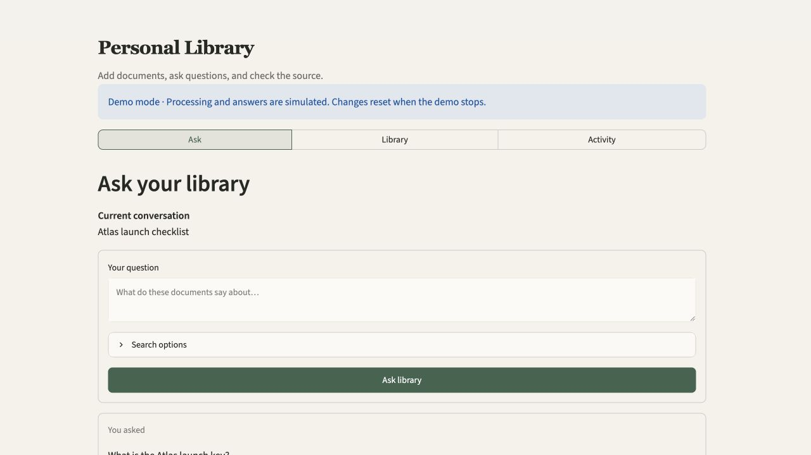

# Personal Library

A self-hosted document library for asking questions and checking the exact source passages behind
each answer.

Add PDFs, Word documents, Markdown, or text. Personal Library prepares them in the background,
keeps conversations across refreshes, and shows the page or section used for every supported
answer.

> **Beta · single user · single host.** Normal use sends document chunks to OpenAI or Voyage for
> embeddings and sends questions plus retrieved passages to OpenAI for answers. Provider charges
> and data policies apply. The app binds to local loopback by default; it is private by deployment
> boundary, not a fully offline system.



## See it first — no API key

You can explore the complete interface with deterministic sample data and no provider calls.
Document processing and answers are simulated; uploaded files are temporary and are not used for
real retrieval in this tour:

```bash
uv sync --all-groups --frozen
uv run python scripts/demo.py
```

Open [http://127.0.0.1:8512](http://127.0.0.1:8512). The demo clearly labels fixture data and
resets when stopped with `Ctrl+C`.

## Run your own library

### Requirements

- Python 3.12
- [`uv`](https://docs.astral.sh/uv/) 0.8.17 or compatible
- Docker with Docker Compose v2
- an [OpenAI API key](https://platform.openai.com/api-keys)

The documented host commands are validated on macOS and Ubuntu. On Windows, use WSL2 for the
documented workflow; native PowerShell has not been validated. GNU Make is needed only for the
contributor shortcuts below.

Clone or download this repository, open its folder, then run:

```bash
python3 scripts/setup.py
docker compose up --build -d
```

The setup assistant asks for the OpenAI key without echoing it, generates two different internal
service tokens, writes a private `.env`, and never prints secret values. Confirm the stack:

```bash
docker compose ps
python3 scripts/setup.py --check
```

Open [http://127.0.0.1:8501](http://127.0.0.1:8501). Stop without deleting stored data:

```bash
docker compose down
```

### Get your first cited answer

1. Open **Library** and add `tests/fixtures/knowledge_base.md`.
2. Open **Activity**. Choose **Refresh** until the job appears under **Completed** and says
   **Complete**, then choose **Ask your documents**.
3. Open **Ask** and enter: `What color is the Atlas launch key?`
4. Expect an answer containing **cobalt blue**, then open **View source** to inspect the supporting
   passage from `knowledge_base.md`.

That is the core workflow: **Add → Process → Ask → Check the source**.

## What the app does

- preserves accepted uploads and processing jobs across restarts;
- searches and filters the document library without loading every record;
- grounds answers in ready document versions and abstains when support is insufficient;
- builds citations from retrieved metadata instead of trusting generated citation prose;
- saves conversations, answers, and source passages durably;
- reprocesses and permanently removes documents through verified background jobs.

Supported files are PDF, DOCX, Markdown (`.md` or `.markdown`), and UTF-8 text, up to 25 MiB each.
Scanned image-only PDFs need an external OCR step.

## Everyday configuration

The setup assistant fills the required values. Most users do not need anything else.

| Setting | What it controls |
|---|---|
| `RAG_OPENAI_API_KEY` | OpenAI answers and default embeddings |
| `RAG_EMBEDDING_PROVIDER` | `openai` (default) or `voyage` |
| `RAG_VOYAGE_API_KEY` | Required only for Voyage embeddings |
| `RAG_API_PORT` | Local API port, default `8000` |
| `RAG_UI_PORT` | Local interface port, default `8501` |

See [Configuration](docs/configuration.md) for provider profiles and advanced settings. Changing
the embedding provider, model, dimensions, parser version, chunk size, or overlap requires a new
compatible collection and deliberate reindex.

## Local development

Install the locked environment, start Qdrant, then run API, worker, and UI in separate terminals:

```bash
python3 scripts/setup.py
uv sync --all-groups --frozen
make qdrant
make api
make worker
make ui
```

The setup assistant creates the local service tokens and collects the provider key required by
the real development stack. Use `uv run python scripts/demo.py` instead when you want the no-key
sample experience.

Development API documentation is at `http://127.0.0.1:8000/docs`. Default tests use deterministic
providers and do not spend provider credits:

```bash
make check
```

Read [Contributing](CONTRIBUTING.md) for the repository map and validation contract, and
[Extending Personal Library](docs/extending.md) for exact parser, provider, API, database, and UI
recipes.

<details>
<summary>Architecture at a glance</summary>

```text
Browser → Streamlit → FastAPI → SQLite metadata, jobs, conversations, retained uploads
                         │  \
                         │   → LlamaIndex retrieval → Qdrant → OpenAI answer model
                         │
                         └── durable jobs ← worker → parser → embedding provider → Qdrant
```

FastAPI is the only system-of-record interface. Long ingestion, reprocessing, and deletion work is
leased from SQLite by a separate worker, so accepted work survives process restarts. Qdrant is a
private authenticated service in Docker Compose. Streamlit is a thin server-side API client and
never receives provider credentials in browser code.

Read the full [Architecture](docs/architecture.md).

</details>

## Documentation

For users and operators:

- [Configuration](docs/configuration.md)
- [Operations, backup, restore, and troubleshooting](docs/operations.md)
- [Security and privacy model](docs/security.md)
- [HTTP API](docs/api.md)

For contributors:

- [Contributing](CONTRIBUTING.md)
- [Extension recipes](docs/extending.md)
- [Validation and proof boundaries](docs/validation.md)
- [Changelog](CHANGELOG.md)
- [Security reporting](SECURITY.md) and [support](SUPPORT.md)

## Honest boundaries

- This is a single-user, single-host system, not a multi-tenant or highly available service.
- Provider-backed use is not fully local; review provider processing, retention, residency, quota,
  and cost before indexing sensitive or regulated material.
- Image-only PDFs are rejected rather than silently indexed without text.
- Library search covers file names and extensions, not document body text, tags, or collections.
- The optional Ask document picker is bounded to the most recent 2,000 ready documents; Library
  browsing itself is server-paginated.
- Compose backup requires coordinated offline snapshots of application and Qdrant volumes.
- Public internet exposure requires TLS and an identity-aware access layer. Do not publish Qdrant
  or treat the built-in bearer token as a complete public identity system.

Licensed under the [MIT License](LICENSE).
