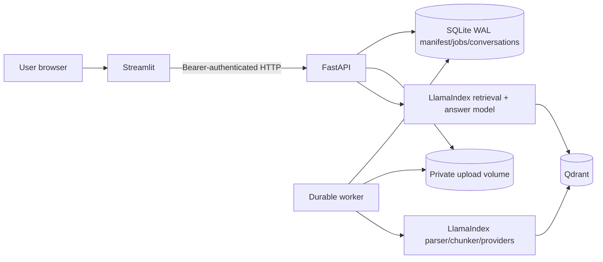

# Architecture

## Product boundary

Personal Library is a production-grade, single-user, single-host RAG system. It is
designed for a laptop, workstation, or one private server. It is not represented as a highly
available multi-tenant SaaS system: PostgreSQL, an external queue, object storage, distributed
locks, tenant authorization, and horizontal worker coordination would be required before that
claim would be accurate.

The production-shaped deployment contains four services:

1. **FastAPI API** — the only public system-of-record interface.
2. **Worker** — leases durable SQLite jobs and performs extraction, embedding, indexing,
   reindexing, and verified deletion.
3. **Qdrant** — a private, API-key-protected persistent vector service. Compose binds its port to
   host loopback only so host-run development processes can use the same service.
4. **Streamlit UI** — a thin server-side API client. It never imports the vector store or receives
   provider keys in browser code.

## Data flow

### Upload and ingestion

1. FastAPI streams an allowlisted file into a UUID staging path while enforcing the byte limit
   and computing SHA-256.
2. The original filename is retained only as a sanitized display name. The manifest stores a
   portable, server-generated relative key; every read/delete resolves that key beneath the
   current upload root and rejects traversal or symlink escape.
3. SQLite receives the document and job in one transaction before the API returns `202`.
4. SHA-256 plus the embedding-profile fingerprint prevents duplicate chunk sets. An optional
   idempotency key prevents a retried request from being bound to different bytes.
5. The worker atomically leases the job and records progress through validating, extracting,
   chunking, embedding, indexing, and verifying stages.
6. Only a fully verified index is marked `ready`. Failed work remains visible with a stable,
   sanitized error code and may be retried.

### Retrieval and answer generation

1. FastAPI validates query length, history depth, `top_k`, and optional document filters.
2. The service snapshots the SQLite manifest of ready document versions before any vector query.
3. LlamaIndex embeds the query and retrieves from Qdrant.
4. Results are filtered against that exact ready-version snapshot, then checked against a fresh
   manifest snapshot immediately before citation return. A queued, failed, reindexing, deleting,
   deleted, or stale document version therefore fails closed even if an old vector remains.
5. Source text is placed inside explicit untrusted-data delimiters. The answer model receives no
   tools and is instructed never to follow source-embedded instructions.
6. Citations are built from retrieved node metadata, not generated citation prose. Unsupported
   citation markers are removed.
7. Empty or low-confidence retrieval returns a deterministic abstention instead of forcing an
   answer.

### Deletion

Deletion is a durable job. The manifest immediately changes to `deleting`, excluding the
document from normal retrieval. The worker deletes exact Qdrant records, verifies zero readback,
and removes the retained source file. Only then does it mark the document `deleted`; partial
failure becomes `deletion_failed` and remains retryable.

Before that delete job commits success, SQLite removes each entire saved turn whose normalized
citation records reference the deleted document. Empty affected conversations are hard-deleted;
non-empty affected conversations are retitled from their first remaining completed question. The
purge and document/job terminal state share one transaction, so the system cannot report a
privacy-complete deletion while cited answer content remains in the active database.

### Durable conversation turns

1. The UI creates a conversation only when the first question is submitted.
2. FastAPI atomically reserves the client turn ID and request fingerprint before any paid provider
   call. The active request owns a random reservation token and renews its lease while provider
   work runs; a recovered request receives a new token.
3. The RAG request history is reconstructed from a bounded window of completed persisted turns;
   pending and failed turns never enter model context.
4. A successful answer and its normalized citation records commit together only if the current
   reservation token still owns the turn and every cited document is still retrieval-ready in
   that same SQLite transaction. Retryable failures retain only the question, scope, safe error
   code, and reservation state—never provider exception text.
5. Completed duplicates return the saved turn. Active duplicates return a retryable conflict, and
   expired or retryable failed reservations can be reclaimed with the same fingerprint. Ownership
   fencing prevents a late result from an older attempt from completing or failing the reclaimed
   turn.

## State ownership

- SQLite is authoritative for document visibility, job state, deduplication, idempotency,
  saved conversations/turns/citations, safe failure details, worker heartbeat, and the active
  embedding profile.
- Qdrant is authoritative only for vector records. It does not decide whether an ingestion or
  deletion operation is complete.
- The upload volume is private application state. No raw-file route is exposed.
- Streamlit session state owns only navigation, unsubmitted draft text, and immediate presentation
  hints. A browser refresh re-reads documents, jobs, conversations, turns, and citations from
  FastAPI. The Activity page refreshes on demand instead of maintaining an idle polling loop after
  work is terminal.

## Embedding compatibility

An immutable fingerprint covers provider, model, dimensions, cosine distance, parser version,
chunker, chunk size, and overlap. Qdrant fixes vector dimensions after collection creation, so a changed
embedding profile must never be mixed into the same collection. The service blocks incompatible
operation and requires an explicit full reindex into a compatible collection.

Supported profiles are:

- OpenAI `text-embedding-3-large`, 3072 dimensions by default.
- Voyage `voyage-3-large`, 1024 dimensions by default. Voyage is used only for embeddings;
  OpenAI remains the answer provider.

## Concurrency and reliability

- SQLite runs in WAL mode with short transactions.
- One worker is the default single-host writer. Jobs use atomic leasing, expiry, attempt bounds,
  and heartbeats for crash recovery.
- Blocking LlamaIndex, provider, and Qdrant work is never performed directly on FastAPI's event
  loop.
- Provider retry policy is bounded and applies only to retryable timeouts, throttles, and selected
  transient failures. Authentication, model, format, and size errors are terminal.
- Production requires the shared HTTP Qdrant service. In-memory and embedded persistence are
  rejected because separate API and worker processes must observe one collection.
- The required document_id keyword payload index is verified on every HTTP collection open and is
  recreated through the same bounded startup retry if a prior creation was interrupted.
- Liveness is process-only. Readiness performs no paid calls; it checks configuration, metadata,
  Qdrant heartbeat, worker freshness, and the exact expected-versus-observed vector inventory.
- Production startup uses bounded Qdrant/provider initialization retries and then exits on
  exhaustion so the container supervisor can restart a failed process instead of serving a
  permanently degraded instance.

## Scaling path

Before adding API replicas, workers on multiple hosts, or multiple users, replace SQLite with
PostgreSQL, move raw files to private object storage, use a production queue with durable leases,
add distributed per-document locking, introduce owner/tenant filters on every row and vector, and
place the API behind TLS plus OIDC. These are deliberate boundary extensions, not hidden
assumptions in the current release.
